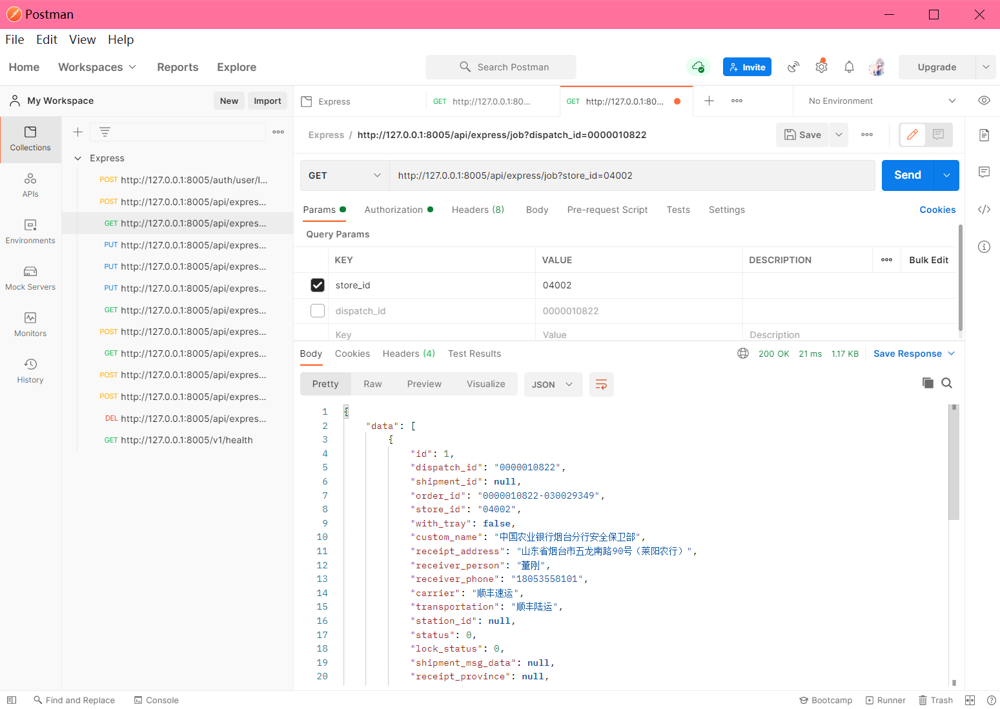
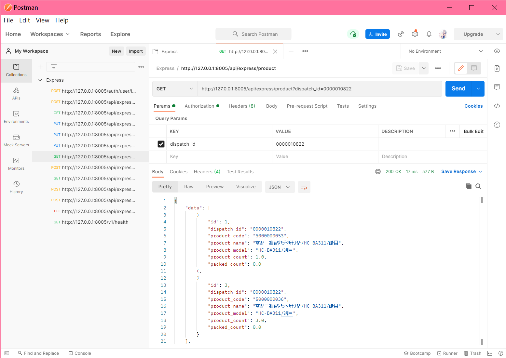
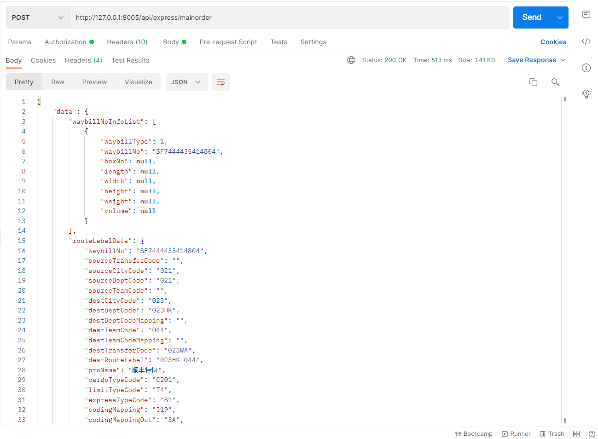

### config 配置
1. dev 开发用
2. prod 部署用
3. db mysql(修改过密码)
4. mongo
5. redis
6. fastapi 配置丰桥，配置保存excel目录MEDIA_ROOT='./'
### controller 路由路径&功能添加
* ./user.py 用于登录，跳转service\user.py，验证密码，hash校验，返回token，存入redis，db存放hash
* 401：unautherized报错，middleware.auth.py
* ./express_job.py 拉任务列表，更新任务，拉sn序号，更改sn
* ./base.py 上传文件

### dao:data access object 数据访问层
1. 猜测为增删改查
### middleware 中间件
1. ./auth.py 验证数据库建表t_user ~~现在会报错401~~
2. ./auth.py 匿名访问那里，添加index路由，加入anonymous_path_list
3. ./connection 

### model 模型/表结构，数据库建表在这找
* ./express_job.py-->db:express.t_express_job
* ./send_store.py-->db:express.t_send_store:仓库id以及地址信息，建表时需要输入

### schema 视图，指給用戶看的部分

### service 服务层
* ./user.py:login_by_password temp查看hash值，数据库中不存密码
### utils 一些工具

### 关于子单号
挺方便的，下单填写包裹数n（一般为1），返回1个母单号+n-1个子单号

后续，打包过程中若包裹数大于填写的包裹数，可以继续申请，可以打一个申请一个

# 流程
1. POST:/api/strategyFile
    * 从前端接收xls，解析返回显示
    * 写入db
    
2. GET:/api/express/job?position_id="04002"
    * 根据发货仓位，拉取TaskList
    * 一个Task对应一个仓位

    
3. PUT:/api/express/job/lock/status
    * 需要传入station_id 加锁
    * 返回，200，锁定成功，,则返回具体信息
        * 客户端调用GET:/api/express/product?dispatch_id="0000010822"
    * 返回，400，已是锁定状态，则返回err信息

4. POST:/api/express/sn
    * 现场工人打包作业，扫码枪录入序列号，一起POST
   
5. POST:/api/express/mainorder
    * 约定返回
        * status=0, redirect->/order
        * status=1, redirect->/sub_order
   
5. POST:/api/express/order
    * ~~向db查询，获取dispatch_id所有信息~~后面再做
    * 需要传入station_id
    * 接收sn_list，下订单，返回运单号
    * 置status=2,写入t_express_job
    * 运单号写入t_express_job,t_express_device_list
    * packed_count写入t_express_product，可以核对数目，不相等的逻辑暂时还没做
    
6. POST:/api/express/sub_order
    * 基本同上

7. PUT:/api/express/job/lock/status解锁
    
8. 快递相关：
    * 上门取件通知（无接口，官方建议线下通知小哥）& 发送邮件
    * expressTypeId = 1 顺丰特快
    * 西藏那个地址会有问题，难道不给送？（在问了，还没回复）

### 调试日志
1. 修改config/db.py,redis.py密码

2. 调试./controller/express_job.py
    * ~~line69-74有何意义？~~能跑就先不管
    * ~~./model，数据库表结构，建表，修改string长度，最长char(255)~~
    * /api/express/job:
        * 抄送一份数据给send_store表？（3.model中写了）
    * 修改 /api/express/job/lock/status:加解锁反了
        * 第一个 if:1,0对应解锁
        * 第二个 if:0,1对应加锁
    * /api/express/order: 
        * 需要指定产品SN，并保存到数据库中,这句话下面加 for device_sn in device_sn_list:
        * for 里面去掉json.dumps
        * get_one(device_sn)
       
3. ./model/
    * 修改 device_list.py:product_id->product_code 与ExpressProduct统一
    
4. 修改 ./schema/objects.py
    * class ExpressProductSchema:create by/update by:注释掉
    * ~~class ExpressProductSchema->id:0->1,数据库设置id自增从1开始~~先不改
    * ~~class ExpressJobSchema->id:0->1~~
    * class ExpressJobSchema:lock_status:char->int/'0'->0
    * class DeviceSchema:product_id->product_code 与ExpressProduct统一
    * class OrderSchema:name->数码产品
    * DeviceCountSchema:int->str/1->''
  
5. /service/
    * base.py:set_model_by_schema:加上if value is not None:
    * ship_order.py:order():order_id = express_job.order_id

6. 函数
    * create() 会加 create_by/update_by
    * update() 
        * 去掉schema中的create_by/update_by
        * 修改./service/base.py.update():model.updated_by->model.update_by

7. 关于PUT?
    * PUT只做更新，POST中的update分句用以
    * 注释掉elif上面的三行，elif->if
    * PUT:/api/express/job:修改if r_id >= 0:下面几行
    * PUT:/api/express/job/lock/status:修改，说不清了，自个对比吧
    * PUT:/api/express/product:修改schema后，逻辑正确
    
8. 接口
    * /auth/user/login
    * GET/POST:/api/express/job
    * GET:/api/express/product:加入station_id
    * GET:/api/express/sn
    * POST:/api/express/sn:修改get_one(device.device_sn_list)连环修改
    * POST:/api/express/order:修改res下面一行，order_result = json.loads(res.text)
    * DELETE:/api/express/order 还没改，待做

9. 记得还原的注释
    * ./controller/order.py: /api/express/order和/api/express/sub_order 下面均有注释掉的，下面还原elif
    
    
### 错误码
调用 POST:/api/express/mainorder
4001 下单时未锁定(一般不会)
4002 station_id不匹配，该任务由其他操作台锁定，你无权操作该任务
4003 sn已存在
4004 产品打包数量超出
4005 该订单不需要此产品
4006 顺丰api报错：POST请求失败，请查找顺丰定义的错误代码以定位问题
4007 顺丰api报错：该地区不可以收派
4008 查询不到母单号(一般不会)

api都上线了，用北京月结账号，上海的他说无效
1. 我发现子订单不能单独消单，他会连母单整个dispatch_id一起消了
2. 